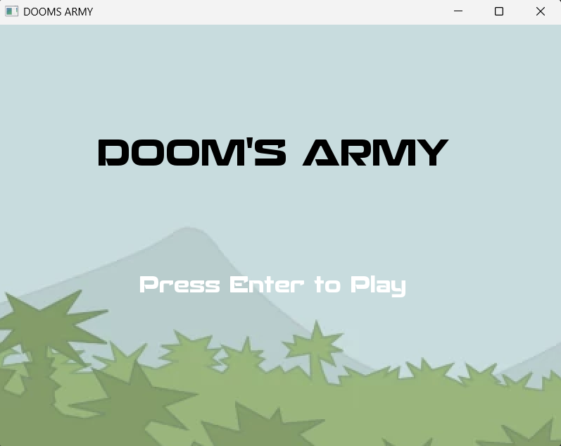
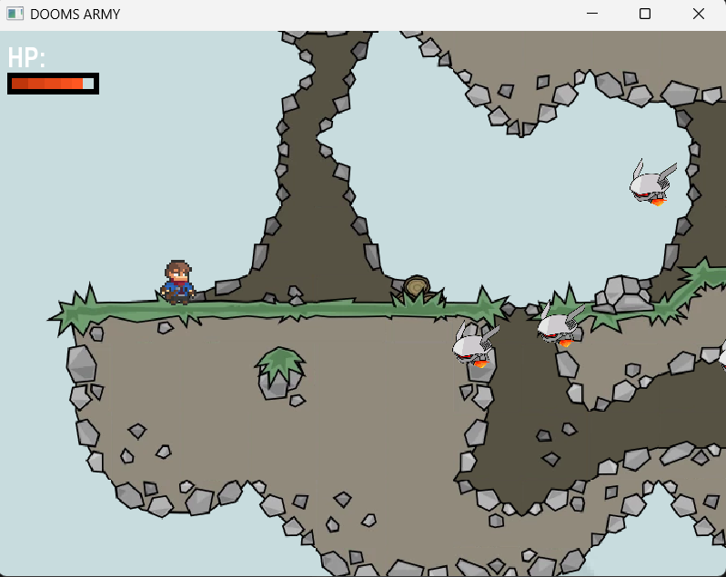
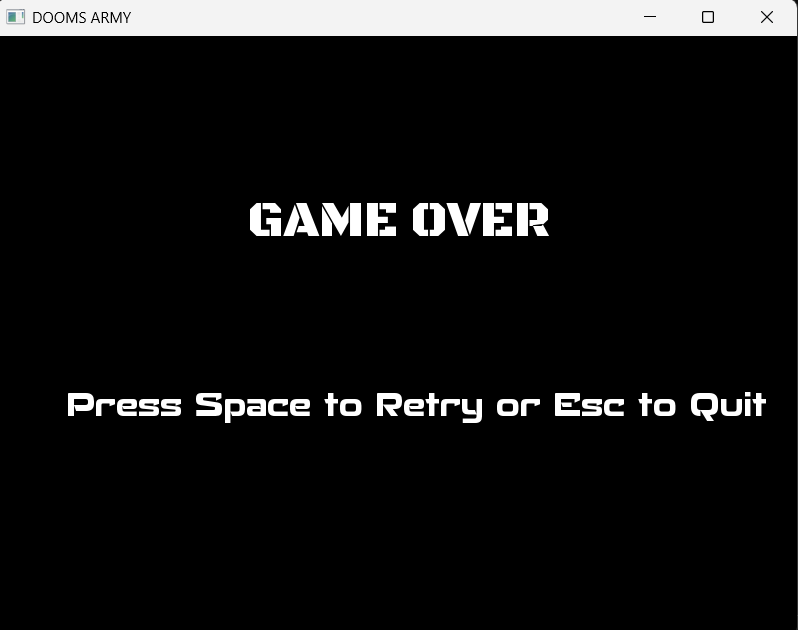

# Dooms Army II

Dooms Army II is a 2D shooting game built with C++ and SFML (Simple and Fast Multimedia Library).  
It is inspired by the gameplay feel of Mini Militia - Doodle Army 2, with focus on fast movement, aim-based shooting, and enemy survival waves.

## Overview

The player controls a character in a 2D world and must eliminate moving enemies while avoiding direct contact attacks.  
Movement is handled with keyboard input, and bullets are fired toward the mouse cursor.  
As enemies spawn and chase the player, positioning, reflexes, and aiming accuracy become important.

The game loop continuously:
- reads input events,
- updates player, enemies, bullets, map/camera, and health state,
- checks collisions (bullet-enemy and player-enemy),
- renders the current frame.

The game ends when player health reaches zero, then shows a game-over screen with retry option.

## Features

- Main menu and game over screens
- WASD movement
- Mouse-based aiming and shooting
- Enemy spawning and pursuit behavior
- Bullet-enemy collision and enemy removal
- Player health system with visual health bar
- Tile/map background rendering with camera view updates

## Controls

- `W`, `A`, `S`, `D`: Move
- `Left Mouse Button`: Shoot
- `Enter`: Start game from main menu
- `Space`: Retry after game over
- `Esc`: Quit

## Tech Stack

- Language: C++
- Graphics/Game Framework: SFML
- IDE/Build System: Visual Studio (`game.vcxproj`)

## Project Structure

- `game/main.cpp`: main game loop and game state flow
- `game/Player.*`: player movement and sprite handling
- `game/Enemy.*`: enemy spawning and chase logic
- `game/bullet.*`: firing, trajectory, and hit detection
- `game/Health.*`: HP state and health UI
- `game/menu.*`: main menu and game over screens
- `game/Map.*`, `game/terrain.*`, `game/background.*`: world rendering elements
- `game/assests/`: textures, maps, and fonts

## Build and Run (Windows)

This project is configured for Visual Studio (`PlatformToolset v143`) and expects SFML in:

- `game/dependencies/sfml/include`
- `game/dependencies/sfml/lib`

Current `.vcxproj` links static SFML debug/release libraries (`sfml-graphics-s(-d).lib`, etc.) and defines `SFML_STATIC`.

### Steps

1. Open `game/game.vcxproj` in Visual Studio.
2. Make sure SFML include/lib paths resolve (or update project property paths).
3. Build `Debug|x64` or `Release|x64`.
4. Run from Visual Studio or execute the produced `.exe`.

## Current Status In This Workspace

- Source code and assets are present.
- No built executable is currently present in the repository.
- `game/dependencies/sfml` is also not present in this workspace, so a local build cannot be verified until SFML is set up.

## Gameplay Screenshots

Add your images under `docs/images/` with these filenames:

- `main-menu.png`
- `gameplay.png`
- `game-over.png`

Then they will render below in GitHub:

### Figure 5.1: Main Menu

### Figure 5.2: Gameplay

### Figure 5.3: Game Over

